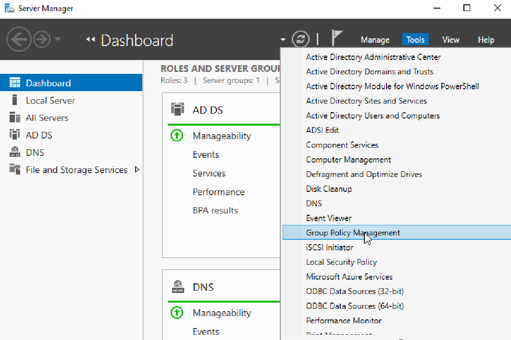
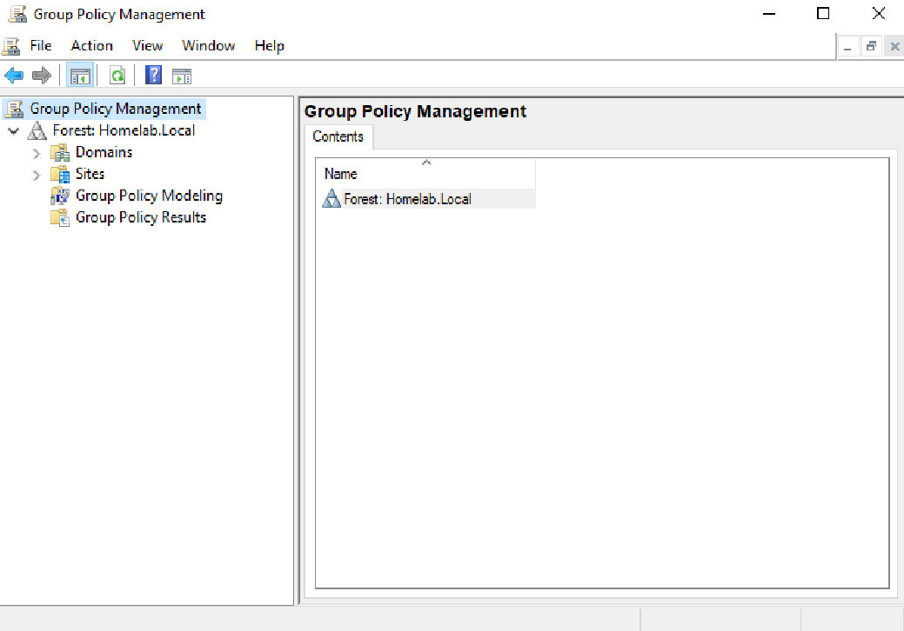
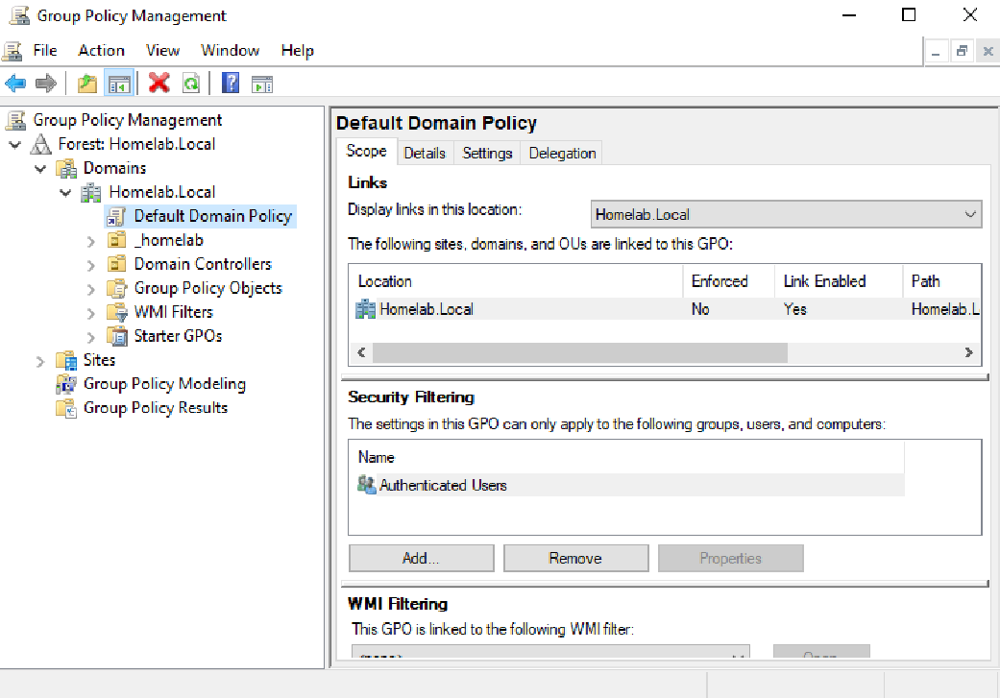
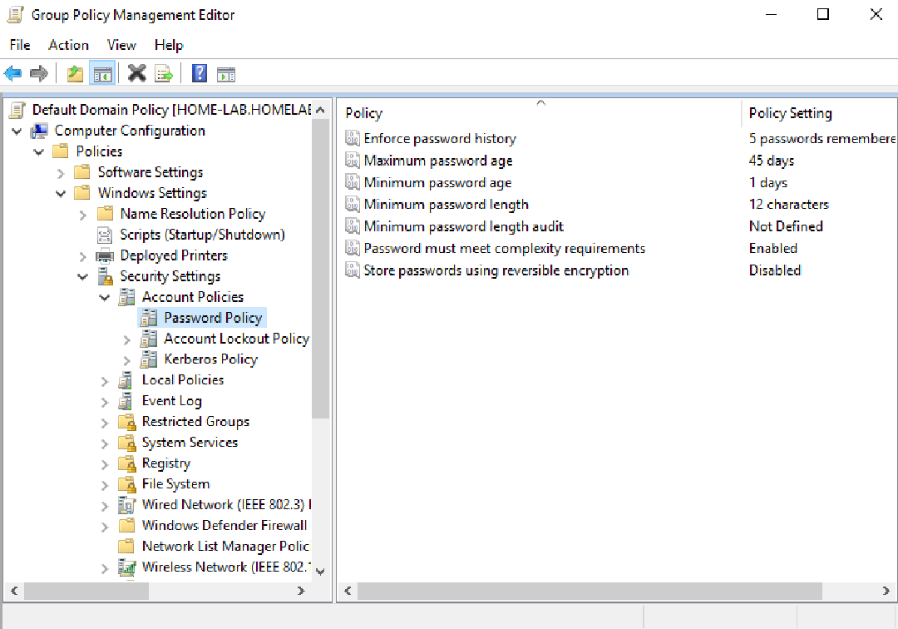
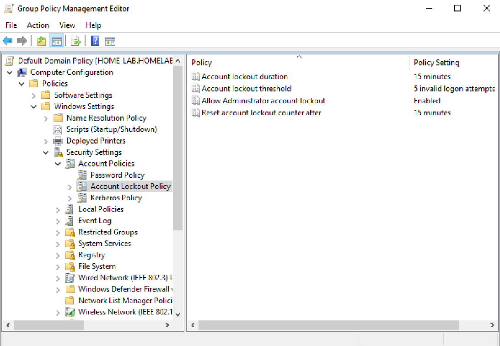
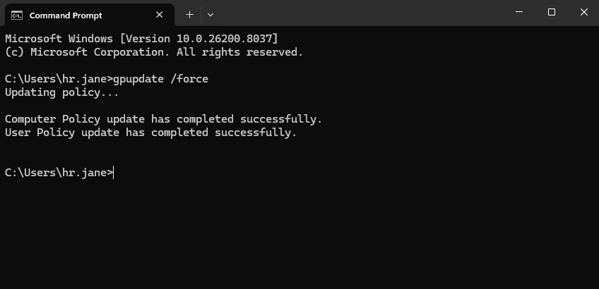
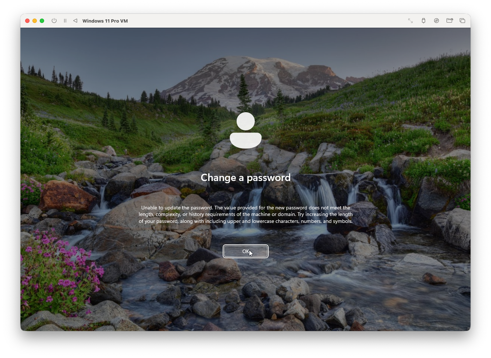
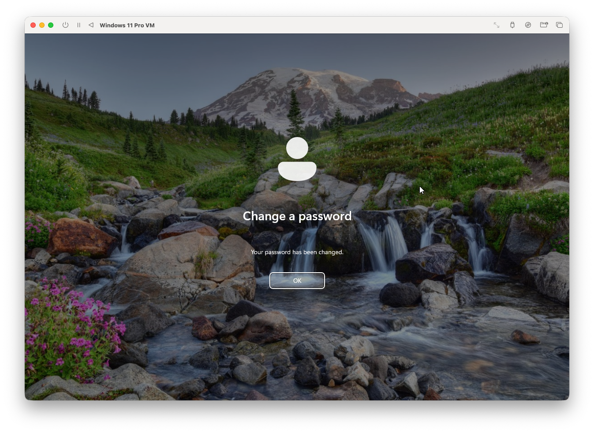

# Group Policy Password Configuration & Verification Lab

## Objective
Configure domain password policies through Group Policy Management (GPO) and verify that the policy applies successfully to domain users in an enterprise environment.

---

## Lab Environment
- Windows Server 2019 Virtual Machine
- Windows 11 Pro Virtual Machine
- Group Policy Management (GPO)

---

## Step-by-Step Configuration

### 1. Start Windows Server and Open Group Policy Management
Opened Windows Server 2019 and launched Group Policy Management from Server Manager.





---

### 2. Locate the Default Domain Policy
In GPO, navigated through Forest → Domain → Default Domain Policy where domain-wide policies for users and computers are managed. 



---

### 3. Configure the Password Policy
Right clicked on "Default Domain Policy" and navigated through Edit → Computer Configuration → Policies → Windows Settings → Security Settings → Account Policies → Password Policy to configure the password policies. 

**Configuration:**



**Password History:** prevents reuse of previous passwords

**Maximum Password Age:** forces password changes every (#) days

**Minimum Password Age:** prevents immediate password changes to bypass history

**Minimum Password Length:** requires longer passwords for stronger security

**Minimum Password Length Audit:** not enforcing a minimum password length

**Password Must Meet Complexity Requirements:** requires a mix of character types to block simple passwords

**Store Passwords Using Reversible Encryption:** ensures passwords are securely hashed and not reversible

---

### 4. Configure Account Lockout Policy
Opened "Account Lockout Policy" and configured policies. 

**Configuration:**



**Account Lockout Duration:** amount of time the account remains locked before it automatically unlocks 

**Account Lockout Threshold:** number of failed logon attempts allowed before account is locked

**Allow Administrator Account Lockout:** determines if built-in Administrator account can be locked after failed logon attempts

**Reset Account Lockout Counter After:** time after failed logon attempts are reset to zero

---

### 5. Apply the Policy
Logged on to a domain-joined client machine and ran `gpupdate /force` to apply the newly configured GPO settings. 

**Command Used**
```
gpupdate /force
```



---

### 6. Verify Newly Configured Group Policy with Password Test
Attempted to change password of domain user to a short password and received error message.  Secondly, attempted to change password following the updated password policy of complexity and minimum password length which succeeded. This confirmed that the GPO password settings were successfully applied and enforced on the client machine. 

Weak password attempt rejected



Successful password change with compliant password



---

### Key Takeaway
- Configured domain password and account lockout policies using Group Policy
- Applied policies to a domain-joined system using `gpupdate`
- Validated policy enforcement through password testing
- Demonstrated understanding of password security controls and policy enforcement in Active Directory environments
